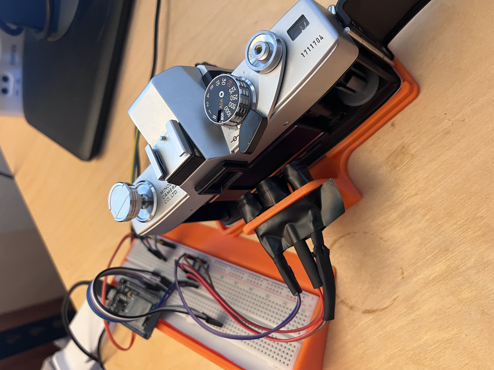
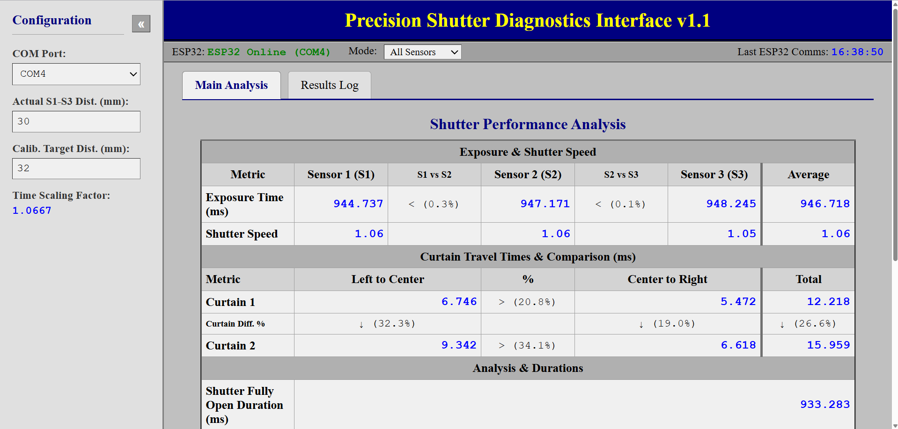

# ESP32 Shutter Tester

This project is an ESP32-based tool for testing camera shutter mechanisms. It utilizes IR LEDs and phototransistors to measure shutter speed and curtain travel times, with results displayed via a web interface.

## Hardware Components

*   3x IR LEDs (each with a 220 Ohm resistor)
*   3x Infrared Phototransistors (each with a 10k Ohm resistor), connected to ESP32 interrupt pins.
*   [5mm LED Holders](https://www.printables.com/model/625992-5mm-led-holder) (external link for 3D printable part)

## Fabrication

*   3D printed parts for the tester rig are available in the `/stl` folder.

## Media

